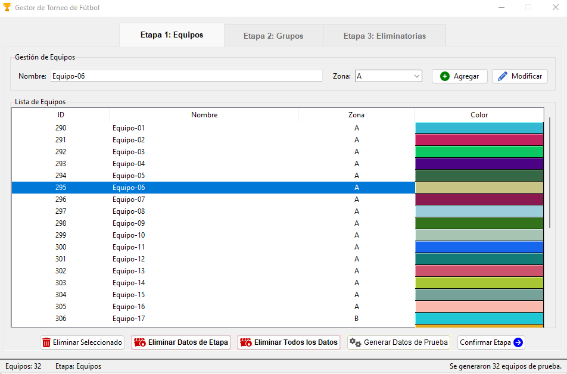

# Gestor de Torneos de Fútbol

Este proyecto es una aplicación de escritorio para la gestión completa de torneos de fútbol, desarrollada en Python. Permite a los usuarios administrar equipos, configurar la estructura del torneo, registrar resultados de la fase de grupos y avanzar a través de las fases eliminatorias hasta coronar a un campeón.

La interfaz gráfica está construida con Tkinter (`ttk`) y los datos se almacenan de forma persistente en una base de datos SQLite. Además, el proyecto cuenta con una suite de tests automatizados para garantizar su fiabilidad y robustez.



## Características Principales

*   **Gestión Completa del Torneo:**
    *   **Fase de Grupos:** Soporta múltiples zonas con un fixture de "todos contra todos".
    *   **Fases Eliminatorias:** Genera automáticamente las llaves de octavos de final (con cruce entre zonas), cuartos, semifinal y final.
    *   **Flujo Guiado:** La interfaz habilita y deshabilita controles de forma inteligente para guiar al usuario a través de las etapas del torneo.

*   **Configuración Flexible:**
    *   Permite definir fácilmente el número de zonas y la cantidad de equipos que clasifican por zona a través de un archivo de configuración (`lib/config.py`).

*   **Gestión de Equipos (CRUD):**
    *   Permite añadir, modificar, visualizar y eliminar equipos fácilmente desde una interfaz dedicada.
    *   Cada equipo recibe un color único para una mejor identificación visual.

*   **Registro de Partidos:**
    *   Interfaz intuitiva para registrar los resultados de cada partido.
    *   La tabla de posiciones se actualiza automáticamente después de cada resultado en la fase de grupos.

*   **Tabla de Posiciones Dinámica:**
    *   Muestra una clasificación en tiempo real con Puntos, PJ, PG, PE, PP, Goles a Favor, Goles en Contra y Diferencia de Goles.
    *   Permite ordenar la tabla haciendo clic en las cabeceras de las columnas.

*   **Calidad de Software Asegurada:**
    *   El proyecto incluye una completa suite de tests automatizados (unitarios y de integración) que cubren la base de datos, la lógica del torneo y la lógica de la interfaz.

## Tecnologías Utilizadas

*   **Lenguaje:** Python 3
*   **Interfaz Gráfica:** Tkinter (`ttk` y `tkfontawesome` para iconos)
*   **Base de Datos:** SQLite3
*   **Testing:**
    *   `pytest`
    *   `pytest-mock`

## Instalación y Ejecución

Sigue estos pasos para poner en marcha la aplicación en tu máquina local.

1.  **Clona el repositorio:**
    ```sh
    git clone https://github.com/benabhi/torneo_app.git
    cd torneo_app
    ```

2.  **Crea un entorno virtual (recomendado):**
    Esto aísla las dependencias del proyecto de tu instalación global de Python.
    ```sh
    # En macOS/Linux
    python3 -m venv venv
    source venv/bin/activate

    # En Windows
    python -m venv venv
    venv\Scripts\activate
    ```

3.  **Instala las dependencias:**
    El proyecto tiene sus dependencias listadas en el archivo `requirements.txt`.
    ```sh
    pip install -r requirements.txt
    ```

4.  **Ejecuta la aplicación:**
    Una vez instaladas las dependencias, puedes iniciar la aplicación.
    ```sh
    python main.py
    ```
    La primera vez que ejecutes el programa, se creará automáticamente el archivo de base de datos `torneo.sqlite3`.

## Ejecución de Tests

El proyecto está cubierto por una suite de tests automatizados para asegurar su correcto funcionamiento. Para ejecutarlos, simplemente corre el siguiente comando desde la raíz del proyecto:

```sh
pytest -v
```
Esto descubrirá y ejecutará todos los tests en la carpeta `tests/`, mostrándote un resumen detallado de los resultados.

## Estructura del Proyecto

El código está organizado de forma modular para facilitar su mantenimiento y escalabilidad.

```
.
├── lib/                                # Directorio con la lógica principal de la aplicación
│   ├── __init__.py                     # Convierte 'lib' en un paquete de Python
│   ├── config.py                        # Configuración central (zonas, equipos, etc.)
│   ├── database.py                     # Gestión de la base de datos (SQLite3)
│   ├── gui.py                          # Lógica y construcción de la interfaz gráfica (Tkinter)
│   ├── logger.py                       # Configuración del sistema de logging
│   ├── logic.py                        # Lógica del torneo (generación de fixtures y llaves)
│   └── widgets.py                      # Widgets personalizados de Tkinter (Tooltip, etc.)
├── tests/                              # Suite de tests automatizados
│   ├── __init__.py                     #
│   ├── test_database.py                # Tests para la capa de base de datos
│   ├── test_gui.py                     # Tests para la lógica de la interfaz
│   └── test_logic.py                   # Tests para las reglas del torneo
├── Docs/                               # Documentación varia
│   ├── Wireframe - Fase X.png.py       # Archivos de imagen de los wireframes de la app
│   ├── database.sql                    # Código SQL para crear la base de datos
│   └── interactive_workgflow.html      # Documento interactivo de como funciona la app
├── scripts/                            # Scripts varios para desarrollo
│   ├── bundle.bat                      # Todo el codigo fuente en un solo archivo (importante para IA)
│   └── bundle_with_line_numbers.bat    # Lo mismo que el anterior pero con numeros de linea
├── .gitignore                          # Archivos a ignorar por Git
├── icon.png                            # Ícono de la aplicación
├── main.py                             # Punto de entrada principal para ejecutar la aplicación
├── pytest.ini                          # Archivo de configuración para pytest
├── README.md                           # Este archivo
└── requirements.txt                    # Lista de dependencias de Python
```
